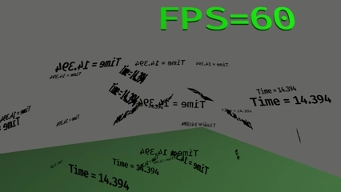

# bevy_text_mesh &emsp; [![Build Status]][actions] [![Latest Version]][crates.io] [![Docs Version]][docs]

[build status]: https://img.shields.io/github/workflow/status/blaind/bevy_text_mesh/test
[actions]: https://github.com/blaind/bevy_text_mesh/actions?query=branch%3Amain
[latest version]: https://img.shields.io/crates/v/bevy_text_mesh.svg
[crates.io]: https://crates.io/crates/bevy_text_mesh
[docs version]: https://docs.rs/bevy_text_mesh/badge.svg
[docs]: https://docs.rs/bevy_text_mesh

A bevy 3D text mesh generator plugin for displaying text in 3D scenes



The text mesh is generated at runtime from runtime-tessellated (and cached) TrueType font glyphs. Tessellation of glyphs is done with C-based [github.com/fetisov/ttf2mesh](https://github.com/fetisov/ttf2mesh/) library that is being interfaced through Rust-based FFI API (see [ttf2glyph-rs](https://crates.io/crates/ttf2mesh)).

## Known limitations

Consider this as a preview of the plugin for gathering feedback about the API:

- **The API will change in future - still iterating**
- Multiple `TextMesh` configuration fields are not implemented yet, see example below
- Text color update is not implemented yet
- Spacing of characters are incorrect
- Mesh cache purging is not implemented - this implementation will leak memory (see [#2](https://github.com/blaind/bevy_text_mesh/issues/2))
- WASM builds are not supported (see [#11](https://github.com/blaind/bevy_text_mesh/issues/11))

## Bevy versions support table

| bevy | bevy_text_mesh |
| ---- | -------------- |
| 0.8  | 0.4.0          |
| 0.7  | 0.2.0          |
| 0.6  | 0.1.0          |
| 0.5  | 0.0.2          |

## Usage

## Prequisites

Prequisites (for compiling [ttf2mesh-rs](https://crates.io/crates/ttf2mesh)):

    apt-get install build-essential patch

## Running the examples

See the [examples](/examples) -folder.

```
git clone https://github.com/blaind/bevy_text_mesh.git
cd bevy_text_mesh
cargo run --example 3d_scene --release # or
cargo run --example performance --release
```

## Integrating to your Bevy App

Add to Cargo.toml:

```
[dependencies]
bevy_text_mesh = "0.4.0"
```

Include the library:

```rust
use bevy_text_mesh::prelude::*;
```

Second, add a `TextMeshPlugin` to your app:

```rust
App::build()
    ...
    .add_plugin(TextMeshPlugin)
    ...;
```

Then, add the desired TrueType-fonts (with suffix `.ttf`) into your assets folder, a good convention is to store them to `assets/fonts` folder.

For example, see Fira fonts. Please read also their [LICENSE](https://github.com/mozilla/Fira/blob/master/LICENSE).

    mkdir -p assets/fonts
    wget https://github.com/mozilla/Fira/raw/master/ttf/FiraSans-Medium.ttf -O assets/fonts/FiraSans-Medium.ttf

Next, you are ready to spawn a text in your scene at a system:

First, load a font asset:

```rust
let font: Handle<TextMeshFont> = asset_server.load("fonts/FiraSans-Medium.ttf#mesh");
```

Then, spawn a textmesh bundle:

```rust
commands.spawn_bundle(TextMeshBundle {
    text_mesh: TextMesh::new_with_color("Hello Bevy", font, Color::rgb(1., 1., 0.)),
    transform: Transform::from_xyz(-1., 1.75, 0.),
    ..Default::default()
});
```

Or with expanded syntax:

```rust
commands.spawn_bundle(TextMeshBundle {
    text_mesh: TextMesh {
        text: String::from("Hello Bevy!"),
        style: TextMeshStyle {
            font,
            font_size: SizeUnit::NonStandard(36.),
            color: Color::rgb(1.0, 1.0, 0.0),
            font_style: FontStyle::UPPERCASE, // only UPPERCASE & LOWERCASE implemented currently
            mesh_quality: Quality::Low,
            ..Default::default()
        },
        alignment: TextMeshAlignment {
            vertical: VerticalAlign::Top, // FUNCTIONALITY NOT IMPLEMENTED YET - NO EFFECT
            horizontal: HorizontalAlign::Left, // FUNCTIONALITY NOT IMPLEMENTED YET - NO EFFECT
            ..Default::default()
        },
        size: TextMeshSize {
            width: SizeUnit::NonStandard(135.),       // partially implemented
            height: SizeUnit::NonStandard(50.),       // partially implemented
            depth: Some(SizeUnit::NonStandard(50.0)), // must be > 0 currently, 2d mesh not supported yet
            wrapping: true,                           // partially implemented
            overflow: false,                          // NOT IMPLEMENTED YET
            ..Default::default()
        },
        ..Default::default()
    },
    transform: Transform {
        translation: Vec3::new(-1., 1.75, 0.),
        ..Default::default()
    },
    ..Default::default()
});
```

## License

Licensed under <a href="LICENSE">MIT license</a>

### Contribution

Unless you explicitly state otherwise, any contribution intentionally submitted
for inclusion in the software by you, shall be licensed as above, without any additional terms or conditions.
